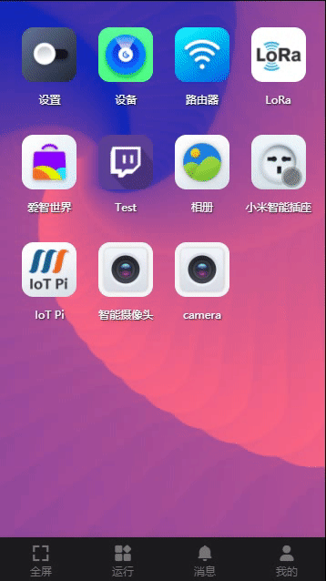
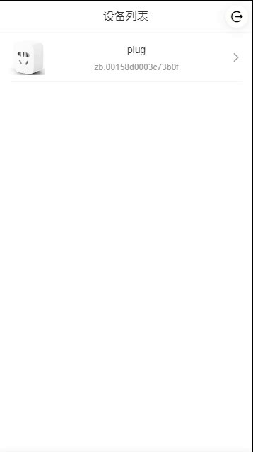
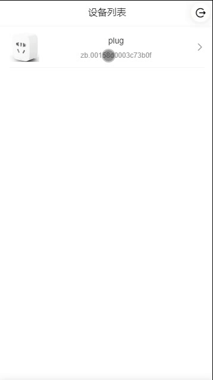
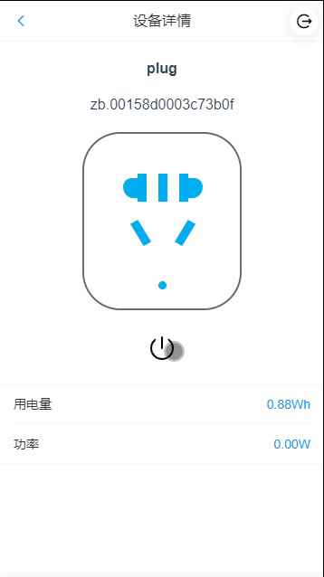
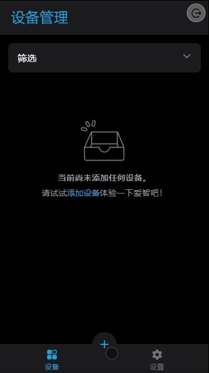

# 小米开关示例
本章示例将实现一个控制小米插座( `ZigBee` 版) 的 `EAP`, 以此展示在 `EdgerOS` 上如何开发一个控制设备的应用。
`EdgerOS` 系统管理接入的 `ZigBee` 设备，`EAP` 应用获取设备权限后就可以按统一的接口访问 `ZigBee` 设备。
设备开发参考资源：【ZigBeeDev : Zigbee ZHA protocol device operation】。

## 工程介绍

### 项目获取
`eap-demo-miplug` 项目链接 : 【 https://gitee.com/edgeros/eap-demo-miplug.git  】或 【 https://github.com/edgeros/eap-demo-miplug.git 】, 项目结构说明：

```
eap-demo-miplug
|-- miplug: EAP项目
|-- web: 前端项目
|-- README.MD
|-- res: 存放静态资源
```

### 功能描述
搜索设备列表：此功能查询连接上 `EdgerOS` 已授权的所有 `miplug` 设备，如下图：

<div align="center">  </div>

设备上线提示：设备上线后 `EAP` 自动弹出消息提示用户，如下图：

<div align="center">  </div>

设备下线提示：设备下线后会自动弹出消息提示用户，如下图：

<div align="center">  </div>

选择设备：【选择设备】-> 【设备列表】，应用也会切换到对当前设备的控制，如下图：

<div align="center">  </div>

开关控制：在设备详情页通过点击按钮来实现对小米插座的开关控制， 如下图：

<div align="center">  </div>

### 前端构建
+ 技术架构
	- 框架：【[Vue](https://cn.vuejs.org/)】。
	- UI： 【[Vant](https://youzan.github.io/vant/#/zh-CN/)】。

+ 如何构建
	- 用 `vscode` 打开 `web` 文件夹。
	- 快捷键 `Ctrl` + `Shift` + <code> &#96;</code>  打开 `vscode terminal`。
	- 执行 `npm install` 安装项目所有依赖。
	- 运行  `npm run build`  构建项目。
	- 构建完后会生成一个 `dist`  文件夹，里面就是构建后的代码。

+ 依赖说明
	- `socket.io-client` : 用于与服务端的双向即时通讯。
	- `vue-socket.io-extended` : `socket.io-client` 在 `Vue` 项目里的扩展包，便于开发者开发。
	- `@edgeros/websdk` 爱智提供与 `EdgerOS` 交互的前端 `api` 接口,在此项目中用到了获取用户 `token` 的接口。

### 后端构建
+ 目录说明

```
miplug
|-- assets: 存图片等一些静态资源
|-- public: 存放前端工程编译后的代码
|-- router: 存放开发者开发的http接口服务
|-- views: 存放页面，前后端分离开发可忽略
|-- edgeros.json: 项目的一些基础配置
|-- jsconfig.json: js运行环境配置
|-- main.js: 应用程序入口
|-- package.json: 包依赖配置
```

+ 依赖说明
	- `device` : 对智能设备进行控制的 `EdgerOS` 模块。
	- `socketio` : 服务端与客户端双向通讯的 `EdgerOS` 模块。

+ 配置部署
	- 将前端工程构建生成 `dist` 文件夹的文件 `copy` 到 `public` 文件夹下。
	- 在 `vscode` 插件库里搜索 `EdgerOS` 并安装。
	- 使用 `vscode EdgerOS` 插件将项目上传到 `EdgerOS` 安装。

## 环境配置
### 设备获取

- 小米智能插座( `ZigBee` 版) , 可从小米官网及各大电商平台购买。
- `Spirit1`  :  【[淘宝 THINGS 翼辉官方店 ](https://shop328678746.taobao.com/?spm=a1z10.1-c-s.0.0.6d16d0a1lA0llo)】。

### 设备连接

- 在 【爱智】-> 【设备管理】中，点击  `+`  发现设备。
- 按小米插座使用说明，长按插座开关按钮直到指示灯闪烁开启搜索。
- 在 【爱智】-> 【设备管理】中搜索到设备后选择添加，在设备列表中可以查看新增的小米插座设备。

<div align="center">  </div>

### 权限配置

创建好应用并安装部署后， 打开 【爱智】-> 【隐私设置】-> 【设备权限】，在设备列表中选择刚连接的小米插座设备，在【已安装应用】列表中选择开发的小米插座应用，打开将其选项开关。

<div align="center">  </div>

## 示例分析
`eap-demo-miplug` 后端项目中，有插座需要使用  `Device` 模块， 用于发现和管理设备，创建设备对象，代码位于：【eap-demo-miplug/miplug/main.js】。

```javascript
var Device = require('device');
```
首先设置两个变量，用于保存发现的小米设备和当前访问的小米设备。
```javascript
/* XiaoMi plug device */
var miplug = undefined;
/* XiaoMi plug devices */
var miplugs = new Map();
```
### 设备发现
+ `EAP` 启动时，初始化获取设备列表：

```javascript
Device.list(true, function(error, list) {
	if (list) {
		list.forEach(function(dev) {
			Device.info(dev.devid, function(error, info) {
				if (info && 
					info.report.name === 'plug' && info.report.vendor === 'lumi' && info.report.model === 'port') {
					miplugs.set(dev.devid, {
						devid: dev.devid, alias: dev.alias, report: info.report
					});
				}
			});
		});
	}
});
```
`Device.list()`  获取设备列表后，`Device.info()` 进一步获取设备详细信息，然后根据设备信息详细筛选出小米插座设备并保存在 `miplugs` 中。
+ 为了将现新设备或设备离线消息及时通知前端，demo 中引入 `socket.io` 与前端实时交互，创建  `socket.io` ：
```javascript
var io = require('socket.io')(
	app, {
		path: '/miplug',
		serveClient: false,
		pingInterval: 10000,
		pingTimeout: 5000,
		cookie: false
	}
);
```

+ 前端  `socket.io` 的使用：
在 `Vue` 项目中安装 `socketio-client`，`vue-socket.io-extended`。	
```sh
npm install socket.io-client@2.3
npm install vue-socket.io-extended
```

这里需要前端与后端进行安全的通信，在 `socket` 连接时加入了 `auth` 参数作为前端认证令牌。
```javascript
const socket = SocketIO({
	path: '/miplug',
	query: auth,
	transports: ['websocket']
});
```

`auth` 对象来源于 `EdgerOS` 提供的安全机制，参考 `API`【Security : Security communication】。
**注意**: 

1. `path`  选项前端后端保持一致。
2. `socketio-client` 只能安装 2.x 版本，由于后端已经固定了 2.x 版本，推荐使用 `socketio-client@2.3` 版本。

+ 当 `socket.io` 前端建立连接时，监听前端获取设备列表的请求：
```javascript
io.on('connection', function(sockio) {
	// ...
	sockio.on('miplug-list', function(result) {
		let devices = [];
		miplugs.forEach((miplug) => {
			devices.push(miplug);
		});
		result(devices);
	});
});
```

前端发送设备列表请求,获取后端设备列表：
```javascript
this.$socket.client.emit("miplug-list", (data) => {
	this.miPlugs = data;
});
```

+ `EAP` 运行过程中，通过 `join`  事件可以监听新设备加入:
```javascript
Device.on('join', function(devid, info) {
	if (info.report.name === 'plug' && info.report.vendor === 'lumi' && info.report.model === 'port') {
		var devobj = {
			devid: devid, alias: info.alias, report: info.report
		};
		miplugs.set(devid, devobj);
		io.emit('miplug-join', devobj);
	}
});
```
将新加入设备保存到设备列表 `miplugs` 中， 同时 `socket.io` 对象将新设备事件 `miplug-join` 通知给所有前端，前端更新设备列表。

前端 `socket` 会通过 `miplug-join` 事件来监听后端的推送，如有新加入设备，弹出消息提示用户，并更新本地设备列表，程序如下：
```javascript
this.$socket.$subscribe("miplug-join", (miPlug) => {
	this.$notify({
		type: "primary",
		message: `新上线了 ${miPlug.alias} 设备`,
	});
	this.miPlugs.push(miPlug);
});
```

+ 同样地， `lost` 事件可以监听设备离线，离线的设备通过 `socket.io` 消息 `miplug-lost` 通知给所有前端：
```javascript
Device.on('lost', function(devid) {
	if (miplugs.has(devid)) {
		miplugs.delete(devid);
		if (miplug && miplug.devid === devid) {
			miplugRemove();
		}
		io.emit('miplug-lost', devid);
	}
});
```
前端 `socket` 会通过 `miplug-lost` 事件来监听后端的推送，如有设备离线，弹出消息提示用户，并更新本地设备列表，程序如下：
```javascript
this.$socket.$subscribe("miplug-lost", (devid) => {
	this.$notify({
		type: "primary",
		message: `${devid} 设备已下线`,
	});
	this.miPlugs = this.miPlugs.filter((miPlug) => {
		miPlug.devid !== devid
	});     
});
```

### 创建设备
+ 每个设备有一个唯一的设备 ` ID（devid)`, 前端从设备列表中选择某个设备时，通过 `REST` 接口将设备 `ID` 发送给后端，`EAP` 后端获取有效 `devid` 后便可创建设备对象：
```javascript
app.post('/api/select/:devid', function(req, res) {
	// ...
	miplug = new Device();
	miplug.request(req.params.devid, function(error) {
		// ...
		miplug.send({ query: true, attrs: ['channel0'] }, function(error) {
			if (error) {
				console.error('Query MiPlug error:', error.message);
			} else {
				console.log('Query MiPlug Ok!');
			}
		}, 3);
	}
}
```
创建 `miplug` 设备对象，通过 `miplug.request()` 与设备关联成功后，`miplug.send()` 检查小米插座是否可用。

前端发送切换设备请求,服务端回复成功，则【设备列表】->【设备详情】，程序如下：

```javascript
axios.post(`/api/select/${miPlug.devid}`, {}, { headers: getHeaders() })
.then(() => {
	this.$router.push({ name: "Details", params: miPlug });
})
.catch((error) => {
	// ...
});
```
**注意**：在创建设备之前 `EAP` 需要获取设备权限，否则执行 `miplug.request()` 时会失败。

### 设备控制
+ 前端通过 `socket.io` 发送小米插座开关控制命令：
```javascript
this.$socket.client.emit("miplug-control", {
	channel0: !this.miPlug.channel0,
});
```

+ 后端监听 `miplug-control` 事件：
```javascript
io.on('connection', function(sockio) {
	sockio.on('miplug-control', function(msg) {
		if (miplug && miplug.devid) {
			console.log('Client send message:', JSON.stringify(msg));
			miplug.send(msg, function(error) {
				if (error) {
					console.error('Send message to MiPlug error:', error.message);
				}
			}, 3);
		} else {
			sockio.emit('miplug-error', { error: 'No device!' });
		}
	});
	// ...
}
```

通过 `miplug.send()` 向设备发送开关命令，开关命令：
```json
{"channel0": true}  // 开电源
{"channel0": false} // 关电源
```

+ `miplug` 设备对象监控 `message` 消息可获得插座开关控制状态变化 ，将结果同步给前端，该事件在 `miplug` 对象创建时监听:
```javascript
miplug.request(req.params.devid, function(error) {
	// ...
	miplug.on('message', function(msg) {
		io.emit('miplug-message', msg);
	});
	// ...
});
```

+ 前端 `socket` 监听 `message` 事件获取后端推送来的设备状态：
```javascript
this.$socket.$subscribe("miplug-message", (msg) => {
	if (typeof msg.channel0 !== "undefined") {
		this.miPlug.channel0 = msg.channel0;
		this.power();
	}
	if (typeof msg.energyConsumed !== "undefined") {
		this.miPlug.energyConsumed = msg.energyConsumed.toFixed(2);
	}
	if (typeof msg.loadPower !== "undefined") {
		this.miPlug.loadPower = msg.loadPower.toFixed(2);
	}
});
```

`miplug-message` 消息：

```json
{"channel0": true }   // 电源开
{"channel0": false }  // 电源关
```

```json
{
	"energyConsumed":5.12 //用电量
	"loadPower": 9.14 //实时功率
}
```